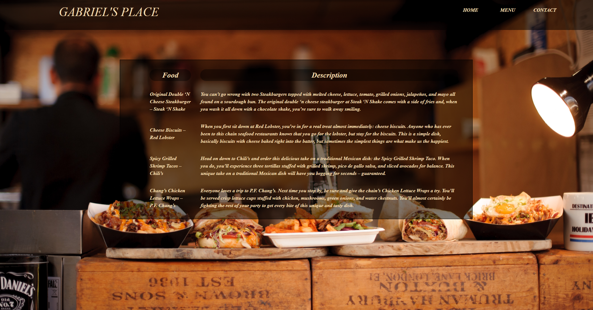

# restaurant-page

> A DOM manipulation project - dynamically rendering a simple restaurant homepage!



Additional description about the project and its features. 

## Built With

- Bootstrap,
- HTML/SASS,
- JavaScript,
- Webpack.

## Live Demo

[Live Demo Link](https://raw.githack.com/ChristianOtieno/restaurant-page/feature/restraunt/dist/index.html)

## Getting Started

**Below are the instructions on setting up the project locally.**

To get a local copy up and running follow these simple example steps.

### Setup and installation

```
git clone git@github.com:ChristianOtieno/restraunt-page.git
```

### Usage

```
run npm install webpack webpack-cli --save-dev
```

> This acrion will install webpack to the node_modules directory of this project.

### Run tests

```
npx eslint .
```

### Run the site

```
run npm install webpack webpack-cli --save-dev
```

> This action will prepare your site and bundle everything together for you

## Authors

👤 **Author**

- Github: [@ChristianOtieno](https://github.com/ChristianOtieno)
- Twitter: [@iamchrisotieno](https://twitter.com/iamchrisotieno)
- Linkedin: [Christian Otieno](https://linkedin.com/linkedinhandle)

## 🤝 Contributing

Contributions, issues and feature requests are welcome!

Feel free to check the [issues page](https://github.com/ChristianOtieno/restraunt-page/issues).

## Show your support

Give a ⭐️ if you like this project!

## Acknowledgments

- Hat tip to anyone whose code was used
- Inspiration.

## 📝 License

This project is [MIT](https://opensource.org/licenses/MIT) licensed.
